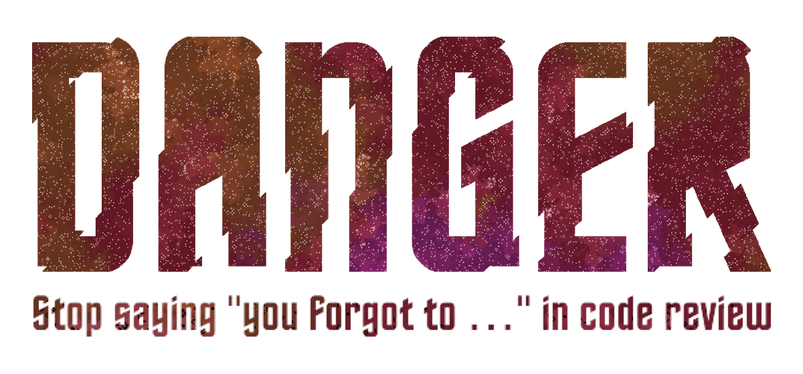
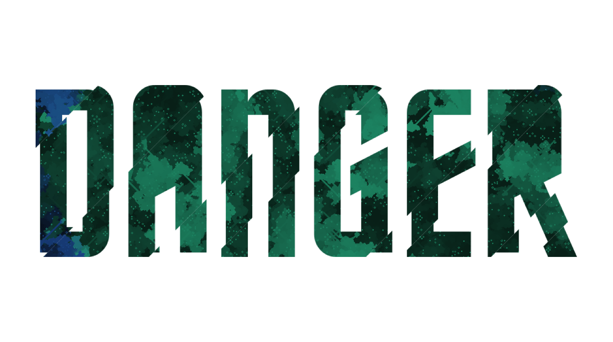
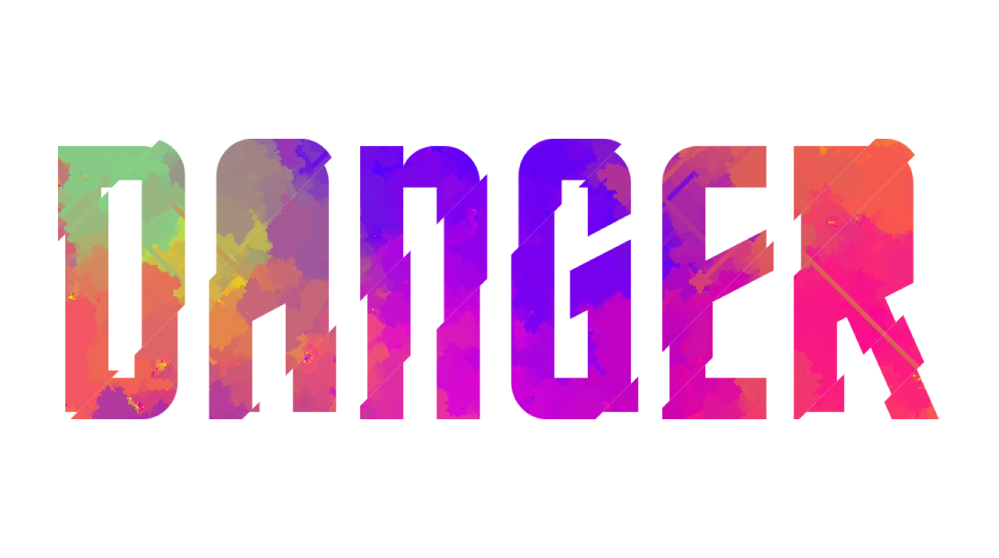
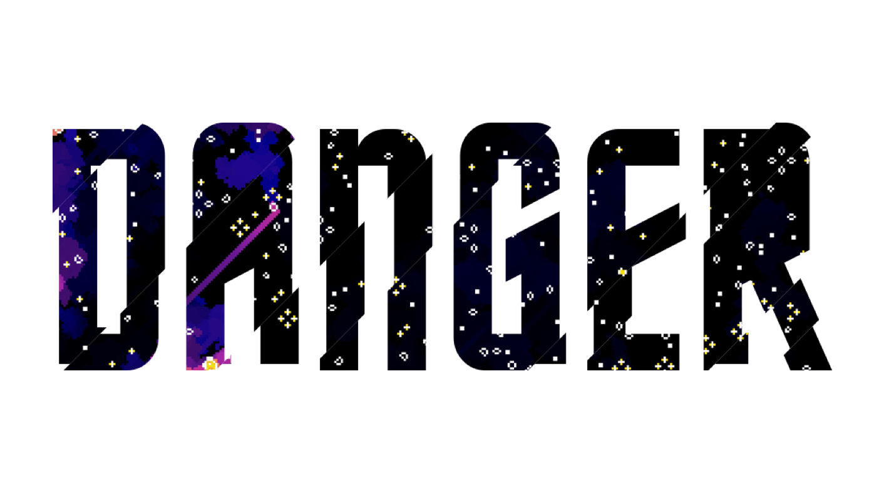
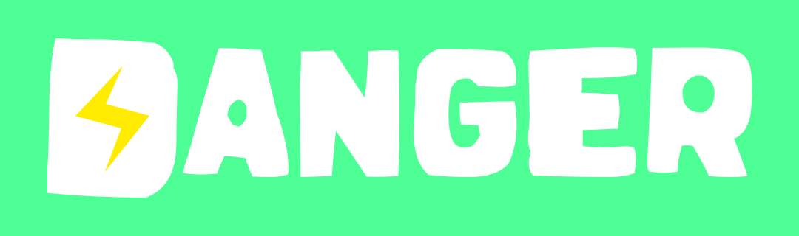

# danger design

Design Work and Media Kit for DangerJS and Danger Ruby, licensed as MIT by Orta Therox. 
Except the fonts Prodotto In Cina and Horta, which isn't mine and comes with it's own weird README/LICENSE.

# JS

### Fonts

The key font is [Horta](https://fontlibrary.org/en/font/horta), which is available [for free here](http://christtrekker.users.sourceforge.net/fnt/horta.shtml). 

## Logos

The DangerJS logo is a tad tricky, strictly speaking the logo is a mask applied to different images. These all come
from the twitter bot [CloudyConway](https://twitter.com/CloudyConway/) by [Vexorian](https://www.patreon.com/vexorian).



and without a tagline, in a higher quality


Also, here are a series of logos that I've enjoyed:








You're welcome to also use the current logo from the homepage, http://danger.systems/js/ and download to re-use.

On the other hand, if you just want a hosted Danger JS Logo, this URL:

```
http://danger.systems/images/js/danger-logo-hero-cachable@2x.png
```

You have no guarantee what this image will look like in the future, so that's fun ;)


I dont have a square logo yet.


# Ruby


### Fonts

The key font is [Prodotto In Cina](http://www.dafont.com/prodotto-in-cina.font), which is available [for free here](http://www.dafont.com/prodotto-in-cina.font). It is also embedded inside this repo in the [fonts](ruby/fonts/) folder.

### Keynote file

The keynote file for this ["Danger in 15m" talk](https://speakerdeck.com/orta/danger-in-15m) is inside the [keynote](keynote/). It's not perfect,  it wasn't made for sharing initially, and it might be out of date. However, if you improve the template I'd love a PR improving it. 

### Images


### Logos

White on Green:


White on Transparent:


Black on Transparent:


### Square Logo


### Fancy moving BG


